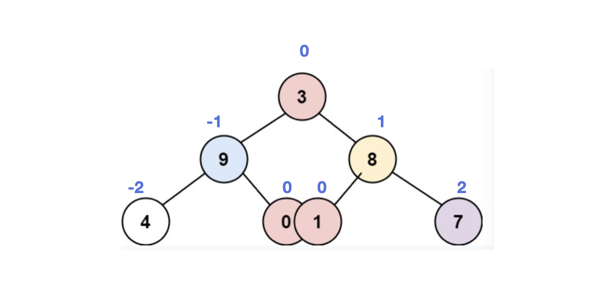

# [314. Binary Tree Vertical Order Traversal](https://leetcode.com/problems/binary-tree-vertical-order-traversal/)

<div><p>Given the <code>root</code> of a binary tree, return <em><strong>the vertical order traversal</strong> of its nodes' values</em>. (i.e., from top to bottom, column by column).</p>

<p>If two nodes are in the same row and column, the order should be from <strong>left to right</strong>.</p>

<p>&nbsp;</p>
<p><strong>Example 1:</strong></p>

<pre><strong>Input:</strong> root = [3,9,20,null,null,15,7]
<strong>Output:</strong> [[9],[3,15],[20],[7]]
</pre>

<p><strong>Example 2:</strong></p>

<pre><strong>Input:</strong> root = [3,9,8,4,0,1,7]
<strong>Output:</strong> [[4],[9],[3,0,1],[8],[7]]
</pre>

<p><strong>Example 3:</strong></p>

<pre><strong>Input:</strong> root = [3,9,8,4,0,1,7,null,null,null,2,5]
<strong>Output:</strong> [[4],[9,5],[3,0,1],[8,2],[7]]
</pre>

<p><strong>Example 4:</strong></p>

<pre><strong>Input:</strong> root = []
<strong>Output:</strong> []
</pre>

<p>&nbsp;</p>
<p><strong>Constraints:</strong></p>

<ul>
	<li>The number of nodes in the tree is in the range <code>[0, 100]</code>.</li>
	<li><code>-100 &lt;= Node.val &lt;= 100</code></li>
</ul>
</div>

<p>&nbsp;</p>

## My Solutions
### Solution-1: BFS
Use a queue to store the Node and customized index when traverse the tree from top to down. The index starts from `0` for root. For the left node, index `minus 1`; for the right node, index `plus 1`.
The nodes with same index represents they are in the same group.


####
```cpp
/**
 * Definition for a binary tree node.
 * struct TreeNode {
 *     int val;
 *     TreeNode *left;
 *     TreeNode *right;
 *     TreeNode() : val(0), left(nullptr), right(nullptr) {}
 *     TreeNode(int x) : val(x), left(nullptr), right(nullptr) {}
 *     TreeNode(int x, TreeNode *left, TreeNode *right) : val(x), left(left), right(right) {}
 * };
 */
class Solution {
public:
    vector<vector<int>> verticalOrder(TreeNode* root) {
        if (!root)  return {};
        
        map<int, vector<int>> m;
        queue<pair<TreeNode*, int>> q;
        q.push({root, 0});
        
        while (!q.empty()) {
            auto [currNode, idx] = q.front();
            q.pop();
            if (m.find(idx) == m.end())
                m[idx] = vector<int>{currNode->val};
            else
                m[idx].push_back(currNode->val);
            
            if (currNode->left) q.push({currNode->left, idx-1});
            if (currNode->right) q.push({currNode->right, idx+1});
        }
        
        vector<vector<int>> res;
        for (auto it = m.begin(); it != m.end(); ++it)
            res.push_back(it->second);
        return res;
    }
};
```