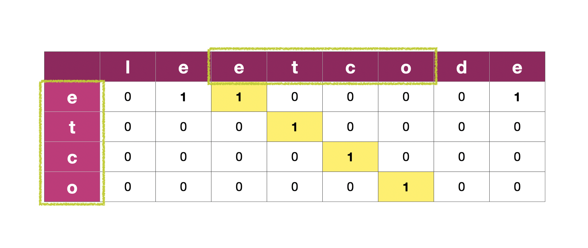

# [583. Delete Operation for Two Strings](https://leetcode.com/problems/delete-operation-for-two-strings/)

<div><p>Given two strings <code>word1</code> and <code>word2</code>, return <em>the minimum number of <strong>steps</strong> required to make</em> <code>word1</code> <em>and</em> <code>word2</code> <em>the same</em>.</p>

<p>In one <strong>step</strong>, you can delete exactly one character in either string.</p>

<p>&nbsp;</p>
<p><strong>Example 1:</strong></p>

<pre><strong>Input:</strong> word1 = "sea", word2 = "eat"
<strong>Output:</strong> 2
<strong>Explanation:</strong> You need one step to make "sea" to "ea" and another step to make "eat" to "ea".
</pre>

<p><strong>Example 2:</strong></p>

<pre><strong>Input:</strong> word1 = "leetcode", word2 = "etco"
<strong>Output:</strong> 4
</pre>

<p>&nbsp;</p>
<p><strong>Constraints:</strong></p>

<ul>
	<li><code>1 &lt;= word1.length, word2.length &lt;= 500</code></li>
	<li><code>word1</code> and <code>word2</code> consist of only lowercase English letters.</li>
</ul>
</div>

<p>&nbsp;</p>

## My Solutions
### Solution 1 : DP
Find the Longest Common Subsequence using dynamic programming

- Time Complexity: O(MN)
- Space Complexity: O(MN)
#### C++ Code: 
```cpp
class Solution {
public:
    int minDistance(string word1, string word2) {
        int n1 = word1.size(), n2 = word2.size();
        vector<vector<int>> match(n1, vector<int>(n2, 0));
        
        for (int i = n1-1; i >= 0; --i) {
            for (int j = n2-1; j >= 0; --j) {
                if (word1[i] == word2[j])   match[i][j] = 1;
                if (i+1 < n1 && j+1 < n2)   match[i][j] += match[i+1][j+1];
                if (j+1 < n2)   match[i][j] = max(match[i][j], match[i][j+1]);
                if (i+1 < n1)   match[i][j] = max(match[i][j], match[i+1][j]);
            }
        }
        
        return n1 + n2 - 2 * match[0][0];
    }
};
```